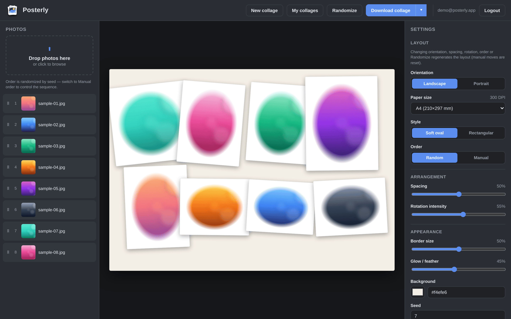
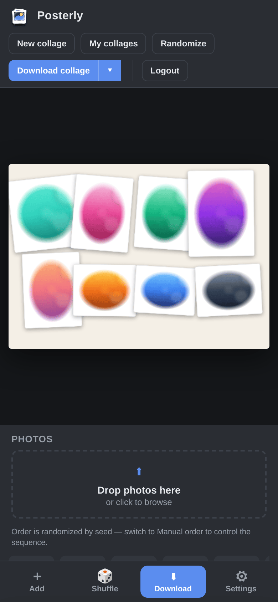
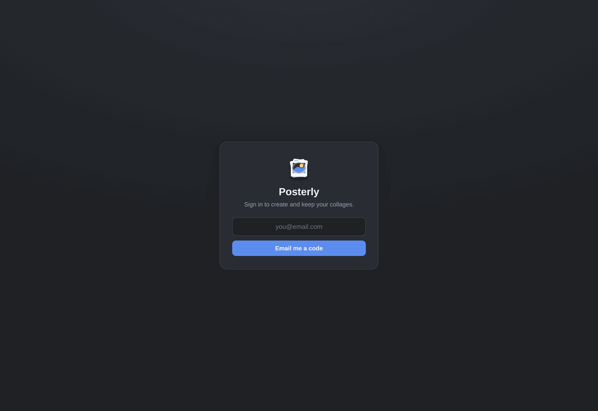

<div align="center">


# Posterly

### Self-hostable photo-collage & poster maker

Turn a folder of photos into a print-ready collage or poster in seconds — drag,
rotate, resize, auto-arrange, then export a crisp **300 DPI PNG or PDF** in any
size from **A5 to A0**, Letter/Legal, or posters up to **1×1.4 m**.
Runs entirely on **your** server. No accounts sold, no cloud, no database.

[](LICENSE)




</div>

---

## ✨ Features

- 🖼️ **Auto-layout** — drop in photos and get a balanced collage instantly; tune
  spacing, rotation, border and glow with live sliders.
- 🎚️ **Hands-on editing** — drag, resize and rotate any photo, reorder the stack
  (z-index), random or manual ordering, per-photo glow/feather.
- 🟢 **Two looks** — soft-oval (feathered ellipse on a white card) or clean paper.
- 📐 **Real print sizes** — A5–A0, Letter, Legal, plus poster formats (30×40,
  50×70, 70×100, 100×100, 100×140 cm), portrait or landscape.
- 📤 **300 DPI export** — print-ready **PNG and PDF**, with timestamped filenames.
- 📏 **Margin guide** — optional dashed safe-area frame (in mm) shown only on
  screen, never baked into the export.
- 📱 **Mobile-friendly** — horizontal photo strip, thumb-reachable bottom action
  bar, settings as a slide-up sheet.
- 🔐 **Passwordless auth** — email one-time codes (via Resend) and/or Google
  Sign-In, gated by a simple email allow-list.
- 🛡️ **Anti-abuse built in** — optional Cloudflare Turnstile, 8-digit OTP codes,
  per-IP and per-email rate limits.
- 🗂️ **No database** — everything is plain files under `./data`; trivial to back
  up, inspect, and reason about.
- 🐳 **One-command deploy** — Docker Compose, with optional Cloudflare Tunnel or
  Caddy auto-HTTPS profiles, and a retention cleanup cron.

## 📸 Screenshots

| Editor (desktop) | Mobile | Sign-in |
| :---: | :---: | :---: |
|  |  |  |

## 🚀 Quick start

> Requires Docker + Docker Compose.

```bash
git clone https://github.com/cristianpatrichi/posterly.git
cd posterly

cp .env.example .env
# Edit .env — at minimum set:
#   APP_ORIGIN   = the URL you'll open (e.g. http://localhost:8787)
#   SESSION_SECRET = a long random string:
python -c "import secrets; print(secrets.token_urlsafe(48))"

# Allow yourself in (one email per line; supports *@domain or *):
cp data/allowed_emails.txt.example data/allowed_emails.txt

docker compose up -d --build
```

Open `APP_ORIGIN`. Sign in with an allow-listed email.

**Just kicking the tyres locally?** Set `OTP_DEV_EXPOSE=1` in `.env` — the sign-in
code is then returned in the `/api/auth/otp/request` response (visible in your
browser's Network tab), so you don't need email configured. **Never enable this
in production.** For real email delivery, add a [Resend](https://resend.com) API
key; for Google one-tap, add a Google OAuth client id (both below).

Try it without your own photos using the bundled CC0 sample images in
[`samples/`](samples/).

## ⚙️ Configuration

All configuration is via environment variables (see [`.env.example`](.env.example)).
The most common ones:

| Variable | Required | Default | Purpose |
| --- | :---: | --- | --- |
| `APP_ORIGIN` | ✅ | — | Public URL of the app (drives CORS, cookie, HTTPS detection) |
| `SESSION_SECRET` | ✅ | — | Secret that signs session cookies (32+ random bytes) |
| `BRAND_NAME` | | `Posterly` | App name shown in the UI and sign-in emails |
| `BRAND_TAGLINE` | | — | Optional text shown next to the name |
| `GOOGLE_CLIENT_ID` | | — | Enables Google Sign-In (empty = hidden) |
| `RESEND_API_KEY` | | — | Enables OTP email delivery via Resend |
| `RESEND_FROM` | | `Posterly <onboarding@resend.dev>` | Sender for OTP emails |
| `TURNSTILE_SITE_KEY` / `TURNSTILE_SECRET` | | — | Enable Cloudflare Turnstile on login (empty = off) |
| `RETENTION_DAYS` | | `60` | Auto-delete collages untouched this long (`0` = keep forever) |
| `MAX_UPLOAD_BYTES` | | see `.env.example` | Per-photo upload size cap |
| `MAX_UPLOAD_REQUEST_BYTES` | | `52428800` | Aggregate multipart request cap |
| `OTP_DEV_EXPOSE` | | off | **Dev only** — return OTP codes in the API response |
| `ENABLE_DOCS` | | off | Expose FastAPI `/docs` (off in production) |

Branding note: `BRAND_NAME`/`BRAND_TAGLINE` are baked into the SPA at build time,
so **rebuild** after changing them (`docker compose build collage && docker compose up -d collage`).
Drop in your own `frontend/src/assets/mark.svg` to replace the logo.

## 🔑 Authentication

Posterly is invite-only by design — only addresses in `data/allowed_emails.txt`
can sign in. Entries support exact addresses, `*@domain.com`, or a lone `*`
(anyone). The file is read fresh on every sign-in, so changes apply instantly.

- **Email OTP (Resend):** verify a sending domain in Resend, set `RESEND_API_KEY`
  and `RESEND_FROM`. Users get a one-time code.
- **Google Sign-In:** create an OAuth *Web* client, add your `APP_ORIGIN` to the
  authorized JavaScript origins, set `GOOGLE_CLIENT_ID`. No client secret needed
  (uses the ID-token flow).

## 🌐 Deployment

The app listens on `127.0.0.1:8787` and expects TLS to be terminated upstream.

- **Cloudflare Tunnel** (no open ports): create a tunnel, route a hostname to
  `http://collage:8787`, then `TUNNEL_TOKEN=... docker compose --profile cloudflare up -d`.
- **Caddy** (auto-HTTPS): `CADDY_DOMAIN=collage.example.com docker compose --profile proxy up -d --build`.
- **Nginx / NPM:** proxy your host to `http://collage:8787`.

> **Upload size:** your reverse proxy caps the per-**request** body. Posterly
> uploads photos in small batches and sends a large photo alone. Keep the proxy
> aligned with `MAX_UPLOAD_REQUEST_BYTES` (e.g. `client_max_body_size 50m;` in Nginx). Cloudflare's
> free tier has a hard ~100 MB per-request limit.

## 🛡️ Security & production defaults

Safe-by-default, no extra config required:

- API docs (`/docs`) **off** by default; OTP dev-expose **off** with an HTTPS fail-fast.
- Session cookies are **HttpOnly + SameSite=Lax**, and **Secure** automatically on HTTPS.
- Cross-origin state-changing requests are rejected (Origin check) on top of SameSite.
- Strict **Content-Security-Policy** and security headers; **TrustedHost** allow-list.
- Rate limits on auth, upload and export endpoints.
- Runs as a **non-root** user in the container (`no-new-privileges`).
- Python dependencies are **hash-locked** (`pip install --require-hashes`).
- Uploaded images are validated and bounded (file count, bytes, megapixels) to
  resist decompression-bomb / memory-DoS.

Found a vulnerability? See [SECURITY.md](SECURITY.md).

## 🏗️ Architecture

```
React + Vite + TS (SPA)  ──/api──▶  FastAPI (Python 3.12)
        │                                  │
   @dnd-kit editor                   Pillow renderer (collage_a4.py)
        │                                  │
   served by FastAPI            filesystem store  ./data/{projects,otp,sessions}
```

- **Filesystem only** — no database. Per-project atomic writes + locks.
- **Single worker** by design (in-memory rate limits, per-project locks, per-email
  OTP counters).
- Optional **cleanup cron** enforces `RETENTION_DAYS`; sessions are 7-day sliding.

## 🧑‍💻 Development

```bash
# Backend tests
python -m unittest discover -s tests

# Frontend (Vite dev server with API proxy)
cd frontend && npm install && npm run dev
# Production build
npm run build
```

See [CONTRIBUTING.md](CONTRIBUTING.md) for the full workflow.

## 🖨️ Standalone CLI renderer

The collage engine also works headless, without the web app:

```bash
python -m venv .venv && source .venv/bin/activate
pip install pillow
python collage_a4.py path/to/photos --orientation landscape
```

## 🤝 Contributing

Contributions are very welcome — see [CONTRIBUTING.md](CONTRIBUTING.md) and our
[Code of Conduct](CODE_OF_CONDUCT.md). Star the repo if you find it useful! ⭐

## 📄 License

[MIT](LICENSE) © Posterly contributors. Sample images in `samples/` are CC0.
